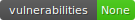

# edgex-compose-builder

[](https://github.com/edgexfoundry/cd-management/pulls) [](https://github.com/edgexfoundry/cd-management/contributors) [](https://github.com/orgs/edgexfoundry/teams/devops-core-team/members) [](https://github.com/edgexfoundry/cd-management/commits) [](https://radon.readthedocs.io/en/latest/api.html#module-radon.complexity)
[](https://pypi.org/project/bandit/)
[](https://www.python.org/downloads/)

## Summary

This python script will update the `edgex-compose/compose-builder/.env` file with the `latest` versions for a given release.

## Pipeline Summary

### Parameters

* **BRANCH** (string) Named branch to create (typically this will be the release name)
* **PUSH_BRANCH** (boolean) Where or not to push the branch to GitHub

The Jenkins automation combines the python script with the compose builder `make` scripts. The automation will generate the env file then will stash the file. The next stage will unstash the env file in the proper directory and will

## Local Usage

Local script usage requires a GitHub [Personal Access Token](https://github.com/settings/tokens) exported to the environment as `GH_TOKEN_PSW`

### `env-builder`

```bash
$ git clone https://github.com/edgexfoundry/cd-management.git
$ pyb install --no-venvs
$ export GH_TOKEN_PSW=<secret>
$ env-builder --help

                         __          _ __    __
  ___  ____ _   __      / /_  __  __(_) /___/ /__  _____
 / _ \/ __ \ | / /_____/ __ \/ / / / / / __  / _ \/ ___/
/  __/ / / / |/ /_____/ /_/ / /_/ / / / /_/ /  __/ /
\___/_/ /_/|___/     /_.___/\__,_/_/_/\__,_/\___/_/


usage: env-builder [-h] [--repo REPO] [--org ORG] [--envfile ENVFILE] [--out OUT] [--no-lookup] [--verbose] [--no-deps] [--deps DEPS]

docker image tag lookup

optional arguments:
  -h, --help         show this help message and exit
  --repo REPO        The repo to lookup tags (default: None)
  --org ORG          The organization to lookup (default: edgexfoundry)
  --envfile ENVFILE  compose env file to read (default: ./.env)
  --out OUT          where to write the generated env file (default: ./.env.new)
  --no-lookup        do not lookup edgex versions (default: False)
  --verbose          verbose logging (default: False)
  --no-deps          do not lookup dependency versions (default: False)
  --deps DEPS        dependency versions to lookup (default: vault consul redis kong kuiper mosquitto)
```

## Reference

[](https://asciinema.org/a/a118Tao1I65u8EtM4yRxWKYOy)

## Examples

If you just want to check the latest version of a specific repository you can run this command:

```bash
$ env-builder --org edgexfoundry --repo edgex-go
edgexfoundry/edgex-go latest released version v1.3.1

$ env-builder --org edgexfoundry --repo device-random
edgexfoundry/device-random latest released version v1.3.1
```

The script will look for a `.env` file in the root of this directory, however you can override that location. You can also override the output location of the generated `.env` file.

```bash
$ env-builder --envfile edgex-compose/compose-builder/.env --out ./.my-env-file
... truncated output
...
Complete...Generated env file to [./.my-env-file]
...
```

The script will attempt to download the latest version of installed dependencies. You can turn this behavior off by passing the `--no-deps`

```bash
$ env-builder --envfile edgex-compose/compose-builder/.env --no-deps
... truncated output
```

If you want to disable latest version lookup in the script, you can pass the `--no-lookup` option. This will essentially just create a copy of the existing env file. You can think of this a the NOOP mode. Good for quickly checking for new dependency versions.

```bash
$ env-builder --envfile edgex-compose/compose-builder/.env --no-lookup
... truncated output
```

## With Docker

```bash
docker build -t edgex-compose-builder:latest -f Dockerfile.build .

docker run --rm \
  -v $PWD:/code -w /code \
  -e GH_TOKEN_PSW=<token> \
  edgex-compose-builder:latest \
  env-builder --envfile ./edgex-compose/compose-builder/.env
```

## Docker Image CLI

Along with env-builder there is also another cli tool that allows you to interaget DockerHub inamge versions

### `docker-image`

```bash
       __           __                   _
  ____/ /___  _____/ /_____  _____      (_)___ ___  ____ _____ ____
 / __  / __ \/ ___/ //_/ _ \/ ___/_____/ / __ `__ \/ __ `/ __ `/ _ \
/ /_/ / /_/ / /__/ ,< /  __/ /  /_____/ / / / / / / /_/ / /_/ /  __/
\__,_/\____/\___/_/|_|\___/_/        /_/_/ /_/ /_/\__,_/\__, /\___/
                                                       /____/
usage: docker-image [-h] --repo REPO [--org ORG] [--filter FILTER]

docker image tag lookup

optional arguments:
  -h, --help       show this help message and exit
  --repo REPO      The repo to lookup tags (default: None)
  --org ORG        The organization to lookup (default: library)
  --filter FILTER  The version to filter by (default: latest)
```

## Examples

Get the latest alpine version of HashiCorp Vault

```bash
$ docker-image --repo vault --filter latest
library/vault {'latest': ['1.7.1']}
```

Get the latest alpine version of the Kuiper image

```bash
$ docker-image --org emqx --repo kuiper --filter alpine
emqx/kuiper {'alpine': ['1.1.2-alpine', '1.1.1-alpine', '1.1.0-alpine', '1.0.2-alpine', '1.0.1-alpine', '1.0.0-alpine', '0.9.1-alpine', '0.9.0-alpine', '0.5.1-alpine', '0.5.0-alpine', '0.4.2-alpine', '0.4.1-alpine', '0.4.0-alpine']}
```
