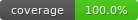
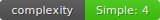
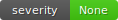
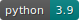

[](https://jenkins.edgexfoundry.org/job/edgexfoundry/job/cd-management/job/create-github-release)
[](https://pybuilder.io/)
[](https://radon.readthedocs.io/en/latest/api.html#module-radon.complexity)
[](https://pypi.org/project/bandit/)
[](https://www.python.org/downloads/)


# cd-management/create-github-release #
A Python script to facilitate creation of GitHub releases with assets.

### `create-github-release` ###

```bash
  ____                _          ____ _ _   _   _       _
 / ___|_ __ ___  __ _| |_ ___   / ___(_) |_| | | |_   _| |__
| |   | '__/ _ \/ _` | __/ _ \ | |  _| | __| |_| | | | | '_ \
| |___| | |  __/ (_| | ||  __/ | |_| | | |_|  _  | |_| | |_) |
 \____|_|  \___|\__,_|\__\___|  \____|_|\__|_| |_|\__,_|_.__/

 ____      _
|  _ \ ___| | ___  __ _ ___  ___
| |_) / _ \ |/ _ \/ _` / __|/ _ \
|  _ <  __/ |  __/ (_| \__ \  __/
|_| \_\___|_|\___|\__,_|___/\___|


usage: create-github-release [-h] --repo REPO --tag TAG --assets ASSETS
                             [--release RELEASE] [--debug]

A Python script to facilitate creation of GitHub releases with assets

optional arguments:
  -h, --help         show this help message and exit
  --repo REPO        GitHub repo where release is to be created
  --tag TAG          The name of the existing tag to associate with the
                     release
  --assets ASSETS    The name of the directory containing the assets to upload
                     to the release
  --release RELEASE  The name to give the release - if not provided will use
                     name of tag
  --debug            display debug messages to stdout
```

#### Environment Variables

* `GH_TOKEN_PSW`  (Required) - The GitHub personal access token used to authenticate GitHub Commands
* `GH_BASE_URL`   (Optional) - GitHub API URL. Can be changed to point to a different GitHub API endpoint

#### Examples

create a release associated with the `v1.2.3` tag in the `soda480/test123` repo and upload all files in the `bin/` folder as assets for the release:
```bash
create-github-release --repo 'soda480/test123' --tag 'v1.2.3' --assets 'bin/'
```

### Development ###

Ensure the latest version of Docker is installed on your development server and clone the repository.

Clone the repository:
```
cd
git clone --branch create-github-release https://github.com/edgexfoundry/cd-management.git create-github-release
cd create-github-release
```

Build the Docker image:
```sh
docker image build \
--target build-image \
--build-arg http_proxy \
--build-arg https_proxy \
-t \
github-release:latest .
```

Run the Docker container:
```sh
docker container run \
--rm \
-it \
-e http_proxy \
-e https_proxy \
-v $PWD:/cr8rel \
github-release:latest \
/bin/sh
```

Execute the build:
```sh
pyb -X
```

NOTE: commands above assume working behind a proxy, if not then the proxy arguments to both the docker build and run commands can be removed.
